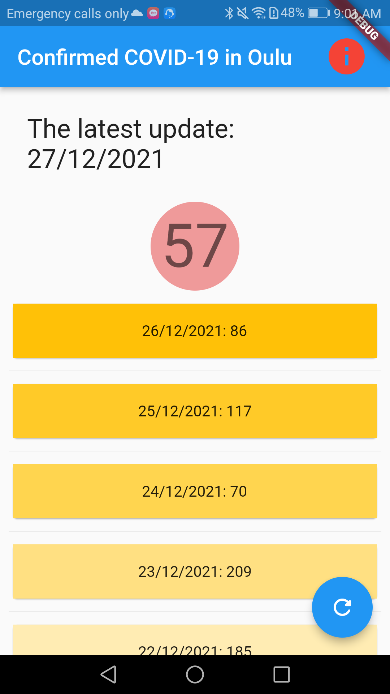
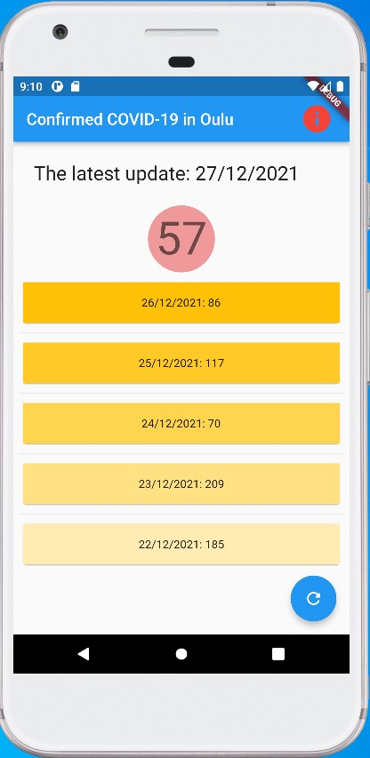

# flutter_covid_oulu

Confirmed Covid-19 in Pohjois-Pohjanmaa (Oulu)
Guoyong Duan, Dec. 29, 2021, Oulu, Finland

# Runtime images

# Data Source

The app is based on the data published in [Helsingin Sanomat Datadesk](https://github.com/HS-Datadesk/koronavirus-avoindata)

# Test and Verification

The app is programmed with Flutter which can work on Android, iOS, Windows and Linux.
With Android Studio, the app works in android emulator, web, android phone (after installation).

# Note

This app is about COVID-19, so it is not allowed to upload to Google Play.

